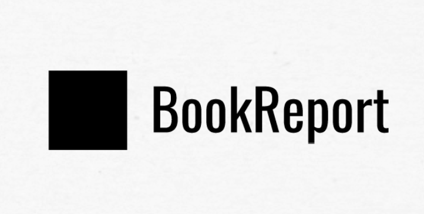

### Library Catalogging Software

## Technical Details
- Home Library Database
    - Add books to library database by ISBN or other UID.
    - Retrieve Metadata about the books you are reading
- Web GUI to...
    - Edit Attributes of books
        - Favorites
        - Priority to Read
        - Notes about the book
        - Links to resources about the book
            - Publisher's website
            - Author's Website
            - Related Social Media
    - Show your library in an aesthetically pleasing manner
        - Internally facing catalog:
            - Private Notes
            - All books in catalog
            - More
    - Web application that is external facing
        - Curated aspects of your library that you select.
        - It's pretty vain, but that's why I want this application too. To be displayed as a widget on my blog.

## Initial Goals
- [ ] Create a basic web application that allows you to view the books in your catalog.
    - Plaintext webpage is fine.
    - Probably find something on Bootstrap
    
## Completed Goals
- [X] Decide on and implement a way to move books that have failed to a failed cache.
- [X] Handle the exceptions thrown when a retrieved book doesn't have an entry on OpenLibrary.
- [X] Create a SQL Database using Docker
- [X] Create a flat database that contains book information
- [X] Find / implement a free book metadata api

## Components used:
### Other bits
- Pure.css
- Bootstrap

### DB
- MySQL

### Python Libraries Used:
- CSV
- NumPy
- Pandas
- PyMySQL
- requests